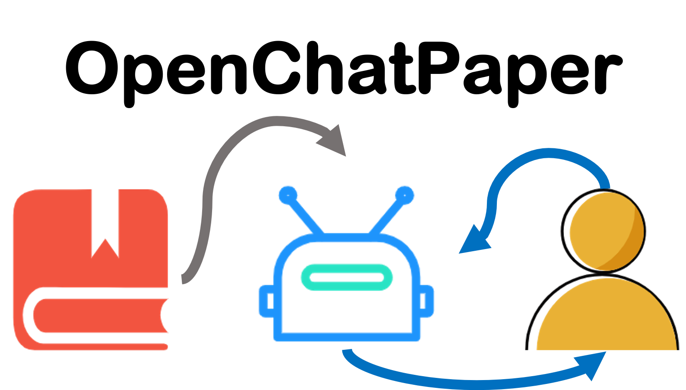

# OpenChatPaper

Yet another paper reading assistant. An open-source version of [ChatPDF](https://www.chatpdf.com/). A different dialogue version of another [ChatPaper](https://github.com/kaixindelele/ChatPaper) project. 

## Online Demo API

> Currently, we provide a demo (still developing) on the [huggingface space](https://huggingface.co/spaces/yixin6178/ChatPaper).


## Setup

1. Install dependencies (tested on Python 3.9)

```bash
 pip install -r requirements.txt
```

2. Setup GROBID local server

```bash
bash serve_grobid.sh
```

3. Setup backend

```bash
python backend.py --port 5000 --host localhost
```

4. Frontend 

```bash
streamlit run frontend.py --server.port 8502 --server.host localhost
```

## Demo Example

- Prepare an [OpenAI API key](https://platform.openai.com/account/api-keys) and then upload a PDF to start chatting with the paper. 


## Implementation Details

- Greedy Dynamic Context: Since the max token limit, we select the most relevant paragraphs in the pdf for each user query. Our model split the text input and output by the chatbot into four part: system_prompt (S), dynamic_source (D), user_query (Q), and model_answer(A). So upon each query, we first rank all the paragraphs by using a sentence_embedding model to calculate the similarity distance between the query embedding and all source embeddings. Then we compose the dynamic_source using a greedy method by to gradually push all relevant paragraphs (maintaing D <= MAX_TOKEN_LIMIT - Q - S - A - SOME_OVERHEAD). 

- Context Truncating: When context is too long, we now we simply pop out the first QA-pair. 

## TODO

- [ ] **Context Condense**: how to deal with long context? maybe we can tune a soft prompt to condense the context
- [ ] **Poping context out based on similarity**

## References

1. SciPDF Parser: https://github.com/titipata/scipdf_parser 
2. St-chat: https://github.com/AI-Yash/st-chat
3. Sentence-transformers: https://github.com/UKPLab/sentence-transformers
4. ChatGPT Chatbot Wrapper: https://github.com/acheong08/ChatGPT


## How to cite

If you want to cite this work, please refer to the present GitHub project with BibTeX:

```bibtex
@misc{ChatPaper,
    title = {ChatPaper},
    howpublished = {\url{https://github.com/liuyixin-louis/ChatPaper}},
    publisher = {GitHub},
    year = {2023},
}
```
